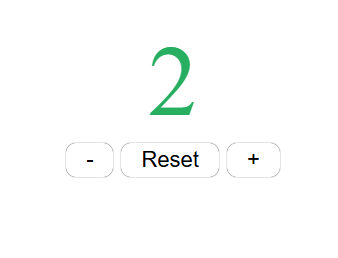

# Vanilla JavaScript Counter (Class-Based)

This project is a simple **counter application built with pure (vanilla) JavaScript**.  
The main goal is not just functionality, but to practice **clean architecture, state management, and event handling** without using any framework.
### 

## ✔️ Features
- Increase / decrease / reset counter
- State management using class instance
- Persistent data with `localStorage`
- Event delegation (single event listener)
- Class-based architecture
- No global scope pollution
- Clean, readable, and maintainable code

## ✔️ What I Learned

While building this project, I practiced and learned the following concepts:

- **JavaScript Class structure**
- **Constructor and instance state management**
- **`this` context and `.bind(this)`**
- **Event delegation pattern**
- **DOM mapping (centralized UI references)**
- **State → UI synchronization**
- **Data persistence using `localStorage`**
- **Single Responsibility Principle**

## ✔️ Techniques Used
- Vanilla JavaScript (ES6+)
- Class-based architecture
- Event delegation
- localStorage API
## ✔️ Project Structure

```text
Counter
├── Counter (Class)
│   ├── constructor
│   ├── bindEvents
│   ├── handleButtonClick
│   ├── increase / decrease / reset
│   ├── render
│   ├── save
│   └── update

