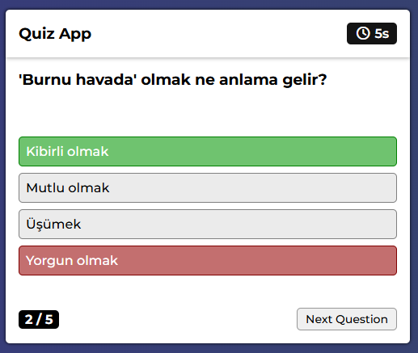

# [EN] Quiz App – Vanilla JavaScript

A quiz application built with **Vanilla JavaScript**, focused on **explicit state management** and **controlled UI flow** without using any framework.

This project is intentionally kept framework-free to demonstrate how application logic, state, and side effects can be handled in plain JavaScript.

### 

## Core Focus
- Predictable application state
- Controlled side effects (timer, user input)
- Clear separation between DOM, state, and logic
- Framework-ready code structure

## Key Implementation Details

### State Management
- Quiz state (current question, score, timer, category) is managed explicitly
- No implicit state derived from the DOM
- State is reset safely between quiz sessions

### Question Flow Control
- Questions are selected randomly per category
- Repeated questions are prevented using `Set`
- Quiz ends deterministically when question limit is reached

### Timer Handling
- Timer lifecycle is fully controlled with `setInterval` and `clearInterval`
- No overlapping or leaking timers
- Timeout is treated as a valid quiz state (answer locked, correct answer shown)

### UI Interaction Safety
- User input is disabled after answer selection or timeout
- UI always reflects application state, not the other way around
- Defensive resets prevent invalid states on restart

## Techniques Used
- Vanilla JavaScript (ES Modules)
- Centralized DOM references
- Manual state management
- `setInterval` / `clearInterval`
- `Set` for uniqueness control
- Event-driven UI updates

---
---
---
# [TR] Quiz App – Vanilla JavaScript

Bu proje, **herhangi bir framework kullanmadan**, tamamen **Vanilla JavaScript** ile geliştirilmiş bir quiz uygulamasıdır.  
Odak noktası bir oyun yapmak değil; **durum yönetimi (state)**, **kontrol akışı** ve **yan etkilerin (side effects)** doğru yönetilmesidir.

Bu nedenle proje bilinçli olarak framework’süz tutulmuştur.

---

## Temel Odak Noktaları

- Öngörülebilir uygulama durumu (predictable state)
- Kontrol altında tutulan yan etkiler (timer, kullanıcı etkileşimi)
- DOM, state ve iş mantığının net ayrımı
- Framework’e taşınabilir kod yapısı

---

## Uygulama Detayları

### Durum (State) Yönetimi
- Quiz’in tüm durumu (aktif soru, skor, süre, kategori) açık değişkenlerle yönetilir
- DOM üzerinden dolaylı state okunmaz
- Quiz her başlatıldığında state güvenli şekilde sıfırlanır

### Soru Akışı Kontrolü
- Sorular kategoriye göre rastgele seçilir
- Aynı soru tekrar edilmez (`Set` kullanımı)
- Belirlenen soru sayısına ulaşıldığında quiz deterministik olarak sonlanır

### Zamanlayıcı (Timer) Yönetimi
- Timer yaşam döngüsü `setInterval` / `clearInterval` ile tamamen kontrol edilir
- Üst üste çalışan timer oluşmaz
- Süre dolması, geçerli bir quiz durumu olarak ele alınır (cevap kilitlenir, doğru cevap gösterilir)

### Kullanıcı Etkileşimi Güvenliği
- Cevap seçildikten veya süre bittikten sonra etkileşim kilitlenir
- UI her zaman state’i yansıtır, state UI’dan türetilmez
- Restart senaryolarında hatalı durumlara karşı savunmalı sıfırlama yapılır

---

## Kullanılan Teknikler

- Vanilla JavaScript (ES Modules)
- Merkezi DOM referansları
- Manuel state yönetimi
- `setInterval` / `clearInterval`
- Tekrarlı veriyi önlemek için `Set`
- Event tabanlı UI güncellemeleri

---

## Proje Yapısı

```txt
quiz-app/
│
├─ index.html
├─ app.js
├─ questions.js
└─ README.md
