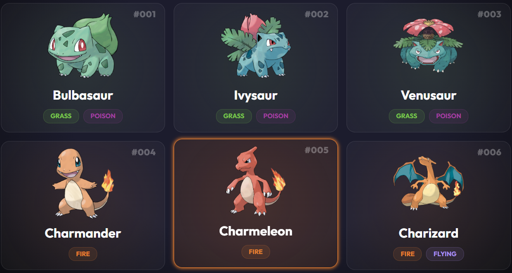

# Details-PokemonApi

This project is a comprehensive example of working with **real-world APIs** and building interactive, modern web applications. By studying this code, you can gain practical experience with asynchronous JavaScript, dynamic content creation, and modern CSS techniques.

### 

##  What Did I Learn and Use in This Project?

### Async JavaScript & Fetch API
- Making asynchronous HTTP requests to external APIs (PokeAPI) using `fetch()`
- Handling responses with `async / await`
- Managing errors properly with `try / catch`
- Understanding how to work with API responses and use the data in the UI

---

### Working with Real APIs
- Understanding API endpoints and how they work
- Using query parameters with `URLSearchParams`
- Structuring requests to retrieve data from third-party services
- Fetching a list of items first, then fetching detailed data in parallel

---

### Dynamic DOM Creation
- Creating HTML elements dynamically using JavaScript
- Using `<template>` elements to define reusable card structures
- Cloning templates with `cloneNode(true)`
- Updating text, images, and attributes dynamically

---

### Performance Optimization
- Using `DocumentFragment` to append multiple elements to the DOM efficiently
- Avoiding unnecessary reflows and repaints
- Rendering lists in a single DOM update instead of multiple updates

---

### Array Methods
- Using `.map()` to transform data arrays into HTML structures
- Using `.join()` to combine HTML strings efficiently
- Looping through API data to generate dynamic UI elements

---

### Modal / Popup Implementation
- Creating a modal to display detailed Pokémon information
- Opening the modal when a card is clicked
- Closing the modal with a button
- Dynamically updating modal content based on the selected Pokémon

---

### Data Handling & Formatting
- Using `dataset` to store Pokémon IDs on DOM elements
- Finding the selected Pokémon using its ID
- Formatting numbers using `padStart()` (e.g. Pokémon IDs)
- Manipulating strings using `replace()` for better readability

---

### Progress Bars & Animations
- Creating stat-based progress bars
- Calculating bar width dynamically based on data values
- Animating progress bars after the modal opens

---

### Modern CSS Techniques
- Using CSS variables (`:root`) for consistent colors
- Applying Flexbox and CSS Grid for layout
- Creating responsive layouts with `auto-fit` and `minmax`
- Adding hover effects and smooth transitions
- Implementing glassmorphism effects with `backdrop-filter`
- Using keyframe animations for subtle UI motion

---

### Responsive Design
- Making the layout adapt to different screen sizes
- Using media queries for desktop, tablet, and mobile views
- Ensuring usability across devices

---

## 📌 Summary

In this project, I learned how to:
- Work with real-world APIs
- Manage asynchronous JavaScript code
- Dynamically generate and update the DOM
- Improve performance with proper rendering techniques
- Structure frontend code in a clean and maintainable way
- Build an interactive and responsive user interface using Vanilla JavaScript
