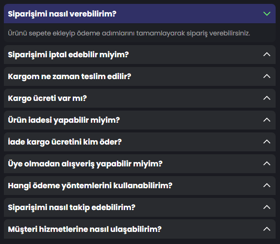

# FAQ Accordion App
This project is a simple and performant **FAQ Frequently Asked Questions Accordion** application built with `Vanilla Javascript`.
### 
## Features
- Dynamic FAQ rendering from `data.js`
- Clean HTML structure usin `template`
- `Event Delegation` with a single event listener
- Only one FAQ item can be open at a time
- Performance-optimized DOM updated usin `DocumentFragment`
- Modular structure with `ES Modules`

## Technologies Used
- HTML5
- CSS3
- Vanilla Javascript (ES+6)
- Javascript Modules
  
## How it Works

### 1.Fetching the Data
- FAQ data is imported from the `faqs.js` file.

### 2.Rendering the UI `renderFaqs funciton`
- Clones the HTML `template`
- Sets question and answer text from the data
- Appends all items to the DOM at once using `DocumentFragment`

### 3.Accordion Behavior
- A single click event listener is attached to the FAQ container
- The clicked `.question` element is detected
- Any previously opened FAQ is closed
- Only the selected FAQ item is toggled

## Installation & Usage

This project uses **JavaScript ES Modules**, so it must be run via a local server.  
Opening the `index.html` file directly will not work.

Example options:
- Live Server (VS Code extension)
- Node.js based servers
- Any simple HTTP server

## Installation
First, clone the repository to your local machine:

```bash
git clone <repository-url>
cd faq-accordion-app
```