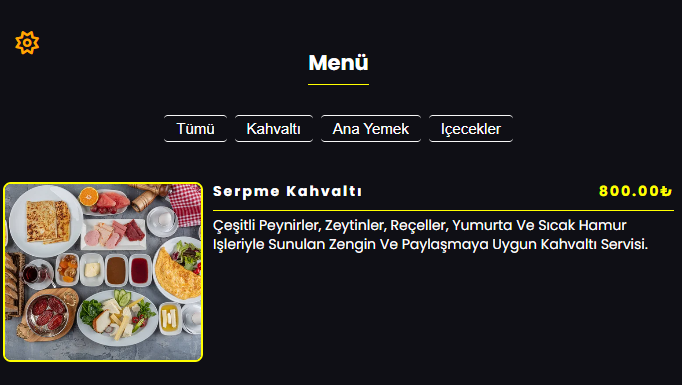

# Menu & Filter System

A performance-focused menu application built with modern JavaScript.
### 
## What I Learned & Implemented

### 1. High Performance Rendering
I used **DocumentFragment** to update the DOM. This groups all changes in memory first, preventing the browser from slowing down by recalculating the layout multiple times.

### 2. Template System
I used the `HTML5 <template>` tag and **cloneNode**. This keeps my HTML structure separate from my JavaScript logic, making the code much cleaner and reusable.

### 3. Event Delegation
Instead of adding listeners to every button, I added one to the **parent container**. Bu saves memory and handles all button clicks in one place.

### 4. Modern Data Handling
* **Destructuring:** To extract data quickly from objects.
* **Set Object:** To find unique categories without duplicates.
* **Array Filter:** To show only the selected menu items.

### 5. Persistent Theme
I used **LocalStorage** to save the Dark/Light mode preference. This way, the user's choice is remembered even after a page refresh.

## Project Structure

* **DOM Cache:** Storing elements in an object for fast access.
* **initApp:** Starting point of the application.
* **renderMenu:** Transforming data into visual cards.
* **toggleTheme:** Managing visual modes and storage.