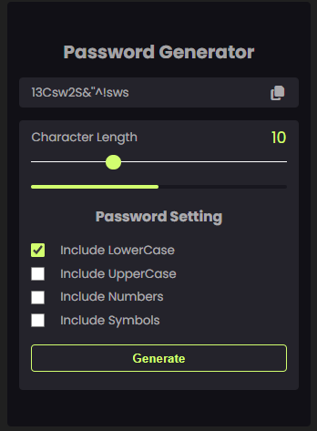

# Secure Password Generator
Modern, lightweight, and user-friendly password generator built with vanilla JavaScript.
### 

## Features
- Generate strong random passwords instantly
- Customizable length (5-30 characters)
- Include/exclude character types
  - Lowercase letters (a–z)
  - Uppercase letters (A–Z)
  - Numbers (0–9)
  - Special symbols
- Real-time password strength indicator(viusal progress bar)
- One-click copy to clipboard with feedback modal
- Clean, responsive UI
- No external dependencies - 100% `vanilla Javascript`
- Optimized DOM access with cached element references

## Tech Stack
- HTML5
- CSS3 (custom properties + modern layout techniques)
- Vanilla JavaScript (ES6+)

# Güvenli Şifre Oluşturucu

Modern, hafif ve kullanıcı dostu bir şifre oluşturma aracı – tamamen saf (vanilla) JavaScript ile geliştirildi.
